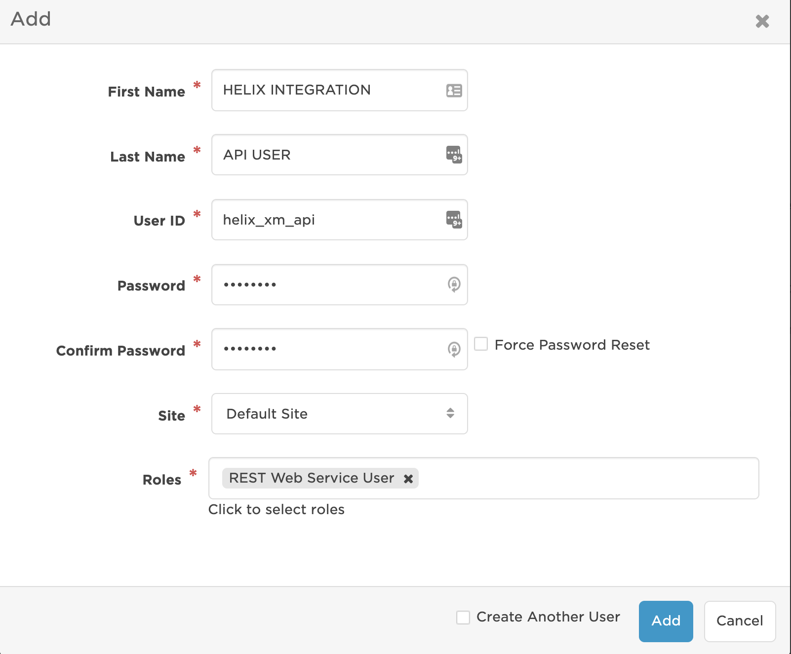

# BMC Remedy and Helix Incident Flow Designer Integration
Notify on-call response teams when critical incidents are reported in Remedy or Helix. With the xMatters and BMC Remedy/Helix (Cloud or On-premise) closed-loop integration, the on-call members of resolver teams are automatically notified via multiple communication channels. When the recipient responds, notes are added to the incident work log and specific incident actions may take place depending on the response.

# Pre-Requisites
* Version 19.08 or later of Remedy/Helix Cloud or On-premise (on-premise uses the xMatters Agent)
* Note, this integration version includes support for version 19.02, and earlier, which POSTs to xMatters using SOAP/XML 
* Account in Remedy/Helix
* xMatters account - If you don't have one, [get one](https://www.xmatters.com)!

# Files
[BMCRemedyandHelixIncident73.zip](BMCRemedyandHelixIncident73.zip) - download this Workflow to get started  
[BMCRemedyHelix_19-08_defs.zip](BMCRemedyHelix_19-08_defs.zip) - download this zip file containing the BMC Remedy/Helix workflow definition files

# How it works
Remedy/Helix triggers one of the xMatters filters as part of the integration. The filter POSTs the Remedy/Helix Incident ID to xMatters, and in turn xMatters uses a Remedy/Helix REST API to get the incident properties and subsequently creates the xMatters Event targeted to the assigned resolver Group.

The notified resolver responds with Assign to me - to take ownership of the incident or Escalate - to escalate to the next resource in the on call schedule.

The closed loop integration annotates the incident work info with xMatters event status, notification delivery status, user responses and user comments. Additionally, an Assign to me response assigns the user to the incident and updates the incident status to In Progress.

# Installation 

## xMatters set up
### Create a REST integration user account

<kbd>
  
</kbd>  

### Install xMatters Agent for integration with Remedy On-Premise
* On the Remedy Mid-Tier Server, where the xMatters Agent is to be installed, open a browser and log in to xMatters. In xMatters on the *Workflows* page in the left navigation bar click **Agents**
* Select the OS of the server from the drop-down list
* Click **Download this version**
* Choose a proxy configuration
* Follow the instructions provided in Step 3
* The xMatters Agent will be installed on the server and the service will automatically start

### Import the Workflow
* Import the **BMC Remedy and Helix | Incident | 7.3** (BMCRemedyandHelixIncident73.zip) Workflow     https://help.xmatters.com/ondemand/xmodwelcome/workflows/manage-workflows.htm

### Assign permissions to the Workflow and Form  
* On the *Workflows* page, click the Edit drop-down menu for the **BMC Remedy and Helix | Incident | 7.3** then select **Editor Permissions**
* Add any users, groups and/or roles to have editor permissions to this workflow
* On the *Workflows* page, click the **BMC Remedy and Helix | Incident | 7.3** then click **Forms**
* Click the **Web Service** drop-down menu for the **Incident Alerts** form
* Select **Sender Permissions** then add the xMatters REST integration user

### Configure List Property Values  
* On the *Workflows* page, click the **BMC Remedy and Helix | Incident | 7.3** then click **Properties**
* Verify/Edit the values in the following list properties so they match available values from Remedy/Helix:  
   Company  
   Contact Sensitivity  
   Escalated  
   Impact  
   Priority  
   Reported Source  
   SLM Status  
   Service Type  
   Status  
   Status_Reason  
   Urgency  
   VIP

### Configure xMatters Flow for Inbound SOAP/XML - for Remedy/Helix v19.02, and earlier, ONLY
* On the *Workflows* page, click the **BMC Remedy and Helix | Incident | 7.3** then click **Flows**
* Click **Incident Alerts Workflow**
* On the canvas, disable the step **Step 01 | Helix | Inbound Request | JSON**
* Delete the hop from **Step 01 | Helix | Inbound Request | JSON** to the **Action** Switch step
* Enable the step **Step 01 | Helix | Inbound Request | XML**
* Connect the **Step 01 | Helix | Inbound Request | XML** to the **Action** Switch step
* Edit the **Action** Switch step, in **Property** select *Step 01 | Helix Inbound Request | XML.Action* then click **Done**
* Edit the following steps to correct the input mappings:  
   Helix | Get Incident | JWT Auth  
   Get Events  
   Helix | Prepare Trigger | Incident  
   Helix | Add Work Info | Incident | JWT Auth
* **Save** the Flow

### Configure Endpoints and Constants  
* On the *Workflows* page, click the **BMC Remedy and Helix | Incident | 7.3** then click **Flows**
* Click **Incident Alerts Workflow**
* Click the **Components** drop-down button in the upper right then select **Endpoints**
* For the Remedy JWT endpoint, type the **Base URL** for the Remedy/Helix environment, for example *https://customer-restapi.onbmc.com* then **Save** then **Close**
* Click the **Components** drop-down button in the upper right then select **Constants**, then edit these constants:
   
| Constant                        | Description                                                                       |
|:------------------------------- |:--------------------------------------------------------------------------------- |
| HELIX_FQDN                      | Fully qualified domain name of the Remedy/Helix Mid-Tier Server                   |
| HELIX_OPT_SIMPLE_GROUP_NAME     | true to use simple group names or false to use Company\*Org\*Group                  |
| HELIX_SERVER_NAME               | Remedy/Helix logical server name                                                  |
| USER_HELIX_PASSWORD             | Password for the integration user in Remedy/Helix used for JWT authentication.    |
| USER_HELIX_USERNAME             | Username for the integration user in Remedy/Helix used for JWT authentication     |
| XMATTERS_INCIDENT_EVENT_IB_PATH | Inbound Integration path (URL Auth) to Step 02                                    |
| XMATTERS_INCIDENT_IB_FLOW_PATH  | Inbound Integration path (URL Auth) to Step 01 (only reqd when using an xM Agent) |

### Get the XMATTERS_INCIDENT_EVENT_IB_PATH  
* On the *Workflows* page, click the **BMC Remedy and Helix | Incident | 7.3** then click **Integration Builder**
* Click the **4 Configured** link for Inbound Integrations
* Click the **Step 02 | Create Event | Incident Alert | Flow** link
* Scroll to the **How to trigger the integration** section then click **Select method** and **URL Authentication** 
* In **Authenticating User** begin typing the username for the REST integration user in xMatters and select the user
* Click **Copy** to copy the URL displayed in *Trigger*
* Be sure to remove everything before `/api/integration/` after pasting in the Constant **XMATTERS_INCIDENT_EVENT_IB_PATH**

### Get the XMATTERS_INCIDENT_IB_FLOW_PATH (only required if using an xM Agent in the integration)  
* On the *Workflows* page, click the **BMC Remedy and Helix | Incident | 7.3** then click **Integration Builder**
* Click the **4 Configured** link for Inbound Integrations
* Click the **Step 01 | Helix Inbound Request | JSON** link
* Scroll to the **How to trigger the integration** section then click **Select method** and **URL Authentication** 
* In **Authenticating User** begin typing the username for the REST integration user in xMatters and select the user
* Click **Copy** to copy the URL displayed in *Trigger*
* Be sure to remove everything before `/api/integration/` after pasting in the Constant **XMATTERS_INCIDENT_IB_FLOW_PATH**

### Verify Flow Designer steps
Some Flow Designer steps are configured with a **Run Location** of either **Cloud** for Remedy On-Demand or Helix On-Demand or **xMatters Agent** for Remedy On-Premise 
* On the *Workflows* page, click the **BMC Remedy and Helix | Incident | 7.3** then click **Flows**
* Click **Incident Alerts Workflow**
* Verify the **Run Location** for all steps on the Flow Designer canvas with labels as identified below:  
   Helix | Add Assignee | Incident | JWT Auth  
   Helix | Add Work Info | Incident | JWT Auth  
   Helix | Get Incident | JWT Auth  
   Helix | API Token | Acquire  
   Helix | API Token | Release  

## Remedy/Helix set up
Configuring BMC Remedy or Helix to integrate with xMatters requires the following steps:

* Import the workflow definition files
* Configure filters
* Configure the ITSM user
* Disable automatic assignments

### Importing workflow definition files
* Log in to the BMC Remedy Developer Studio, and then select **File** > **Import**
* Select **BMC Remedy Developer Studio** > **Object Definitions**, and then click **Next**
* Select the AR System server into which you want to upload the integration objects, and then click **Next**
* Do one of the following:  
      Type in the location of the `xm_foundation_REST.def` file  
      Click the Browse button to the right of the text field and navigate to the location of the `xm_foundation_REST.def` file. Select the file, and then click **Open**.  
* Click **Next**  
      If you have already imported a workflow definition file, ensure that you select the Replace Objects on the Destination Server check box (do not select the other check boxes), but note that any changes you have made to those objects will be lost. If you are sure the changes you made are necessary for your installation, you will be required to re-apply those changes to the new version of the files being imported unless you applied those changes to overlay objects.  
* Repeat the above steps to import the `xm_incident_REST.def` file.  
      Note this file must be imported after the foundation file.  
Click **Finish**

### Configuring filters
The integration includes a filter and an escalation that use the Set Fields action to consume a web service; these objects need their endpoints changed to the address of the appropriate (JSON or XML) *Step 01 | Helix Inbound Request* inbound integration for On-Demand or to the address of the xMatters Agent for On-Premise.  
Filter: XM:EI:EventInjection_100  

#### For Remedy/Helix On-Demand (v19.08 or later), get the endpoint URL
* On the *Workflows* page, click the **BMC Remedy and Helix | Incident | 7.3** then click **Integration Builder**
* Click the **4 Configured** link for Inbound Integrations
* Click the **Step 01 | Helix Inbound Request | JSON** link
* Scroll to the **How to trigger the integration** section then click **Select method** and **URL Authentication** 
* In **Authenticating User** begin typing the username for the REST integration user in xMatters and select the user
* Click **Copy** to copy the URL displayed in *Trigger*
* Paste the full URL as the endpoint in the Remedy/Helix filter

#### For Remedy/Helix On-Demand (v19.02), get the endpoint URL
* On the *Workflows* page, click the **BMC Remedy and Helix | Incident | 7.3** then click **Integration Builder**
* Click the **4 Configured** link for Inbound Integrations
* Click the **Step 01 | Helix Inbound Request | XML** link
* Scroll to the **How to trigger the integration** section then click **Select method** and **URL Authentication** 
* In **Authenticating User** begin typing the username for the REST integration user in xMatters and select the user
* Click **Copy** to copy the URL displayed in *Trigger*
* Paste the full URL as the endpoint in the Remedy/Helix filter

#### For Remedy On-Premise, get the endpoint URL for the xMatters Agent
* On the Workflows page, click the **BMC Remedy and Helix | Incident | 7.3** then click **Integration Builder**
* Click the **4 Configured** link for Inbound Integrations
* Click the **Step 00 | Incoming Remedy | xM Agent** link
* In **Integration Settings** *Step 1*, select **xMatters Agent** in **Location** and select the appropriate Agent
* Scroll to the **How to trigger the integration** section then click **Select method** and **URL Authentication** 
* In **Authenticating User** begin typing the username for the REST integration user in xMatters and select the user
* Click **Copy** to copy the URL
* Paste the full URL as the endpoint in the Remedy/Helix filter

### Configuring ITSM user
The integration requires a dedicated ITSM user to interact with incidents.

#### Create an ITSM user
First, create a new ITSM user with the Incident Master role in BMC Remedy/Helix; the user does not need to be Support Staff.

<kbd>
  
</kbd>

**Note: If you specify a Login ID of "xmatters" for this ITSM user, you can skip the following two update steps.**

#### Update the filter qualification
The XM:Incident_Re-Assigned_899 filter contains the following qualification criteria: `($USER$ != "xmatters")`  

This qualification prevents the integration from sending a second notification based on an incident's assignment changing because of a user response to an earlier notification. Replace `xmatters` with the name of the ITSM user created in Step One.

<kbd>
  
</kbd>

#### Update the default assignee
The out-of-box permissions allow the Submitter and Assignee (and BMC Remedy administrators) to search instances of the XM:Event Injection form. This allows users who modify incidents to see the corresponding XM:Event Injection instance for their update. To allow the ITSM user to also see all the Event Injection forms, modify the default value for the Assigned To field to the ITSM user you created.  

<kbd>
  
</kbd>

### Disabling automatic assignment
To allow xMatters to control assignments, you must turn off the automatic assignment feature in BMC Remedy.

**Note: To perform this step, you will need to login as a user with Administrator permission.**

* Log in to the BMC Remedy Mid Tier web server.
* Click **Applications**, and then click the **Administrator Console** left-menu item.
* Click **Application Administration Console**.
* On the **Custom Configuration** tab, expand **Incident Management**, and then expand **Advanced Options**.
* Select **Rules**, and then click **Open**.
* Click the **New search** button then click the **Search** button to perform a search for all existing "Incident Rules".
* For each existing rule, do the following:  
      Select the rule, and in the **Assignment Process** drop-down list, select **(clear)**.  
      Click **Save**.  
      Alternatively, you can set **Assignment Engine Integration** to "No", then **Save**.  

# Testing

## Triggering a notification
To trigger a notification, create a new incident with a priority of High or Critical in BMC Remedy/Helix, and assign it to
a user or group that exists in both BMC Remedy/Helix and xMatters:  

<kbd>
  
</kbd>

## Responding to a notification
In the following example, the notification is received on an Apple iPhone, but the process is similar for all devices.  

* Notifications appear in the application Inbox  

<kbd>
  
</kbd>  

* Opening the notification displays the details  

<kbd>
  
</kbd>  

* After viewing the details, either click the respond (blue return arrow) icon at the top or scroll to the bottom of the notification  

<kbd>
  
</kbd>  

* Tap the desired response, then tap **Respond now** or **Respond with comment**  

<kbd>
  
</kbd>  

# Troubleshooting
If an xMatters notification was not received you can work backwards to determine where the issue may be:  
* Review the xMatters Reports tab and the specific [Event Log](https://help.xmatters.com/ondemand/installadmin/reporting/eventlogreport.htm)  
* If no Event was created, review the [xMatters Workflows Flow Designer Activity Panel](https://help.xmatters.com/ondemand/xmodwelcome/flowdesigner/activity-panel.htm)  
* If no activity was recorded, in Remedy/Helix review the XM:Event Injection Form and the XM:Action Form and the Remedy/Helix logs for a POST to xMatters.
